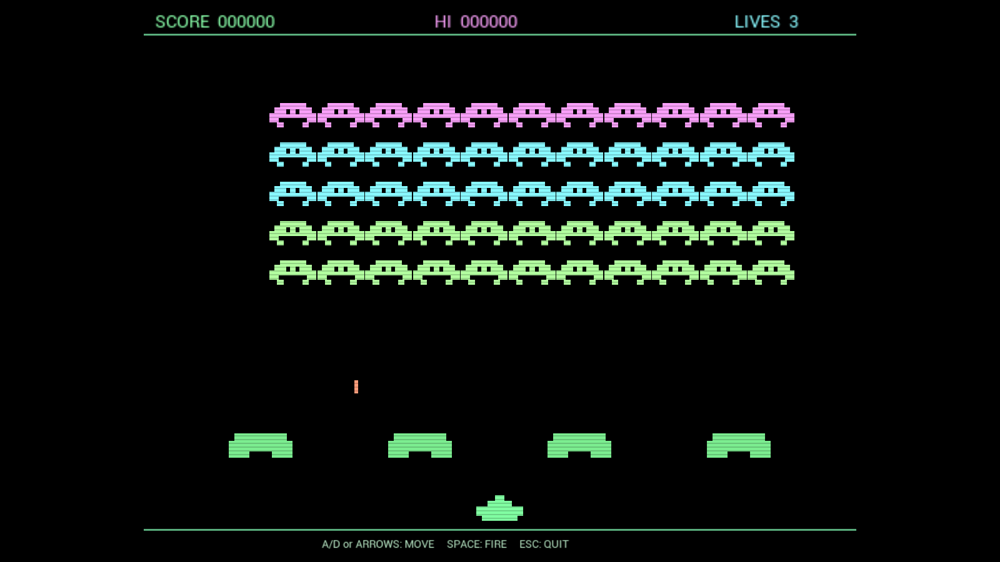

# Retro Invaders UE5

Unreal Engine 5.5とC++で制作した、レトロな固定画面シューティングゲームです。

ピクセル風の画面はUE5のHUD描画機能で構成し、効果音はすべてゲーム実行中に合成しています。外部の画像素材や音声素材は使用していません。



## 紹介動画

[](https://www.youtube.com/watch?v=GmzlHmN2rwk)

[YouTubeで動画を見る](https://www.youtube.com/watch?v=GmzlHmN2rwk)

## ダウンロード

[GitHub ReleasesからWindows版をダウンロード](https://github.com/tamtam19641002-jpn/retro-invaders-ue5/releases/latest)

ZIPを展開し、`Windows/RetroInvaders.exe`を実行してください。`exe`単体では動作しないため、展開後のフォルダー構成を維持してください。

## 特徴

- 55体の敵による移動編隊
- STARTボタン付きのレトロなタイトル画面
- 自機と敵の射撃処理
- 着弾位置から徐々に欠けていく破壊可能な防壁
- 画面上部を飛行するボーナスUFO
- 進行音と同期した段階的な敵移動
- 得点を維持したウェーブ進行
- スコア、ハイスコア、残機システム
- 敵が減るほど移動と進行音が高速化
- 発射音、爆発音、敵弾、4音の進行音をリアルタイム合成
- CRT風の走査線表示
- 1280x720の可変ウィンドウと全画面切り替え
- キーボード操作対応

## 操作方法

| キー | 操作 |
| --- | --- |
| STARTボタン、`Enter`または`Space` | タイトル画面から開始 |
| `A` / `D`または左右キー | 移動 |
| `Space` | 発射 |
| `R`または`Enter` | クリア・ゲームオーバー後に再開 |
| `F11` | ウィンドウ表示と全画面を切り替え |
| `Esc` | 終了 |

## 必要環境

- Unreal Engine 5.5
- C++ワークロードを導入したVisual Studio 2022 Build Tools
- Windows 10またはWindows 11

## Unreal Engineで開く

1. このリポジトリをクローンします。
2. `RetroInvaders.uproject`を右クリックします。
3. **Generate Visual Studio project files**を選択します。
4. Unreal Engine 5.5でプロジェクトを開きます。
5. ビルドを求められた場合は`RetroInvadersEditor`をビルドします。
6. **Play**を押します。

## コマンドラインでビルド

```powershell
& 'C:\Program Files\Epic Games\UE_5.5\Engine\Build\BatchFiles\Build.bat' `
  RetroInvadersEditor Win64 Development `
  '-Project=C:\path\to\RetroInvaders.uproject' -WaitMutex
```

## 権利関係

固定画面型アーケードゲームのジャンルを参考にしたオリジナル作品です。元祖スペースインベーダーの画像、音声、コードは含まれていません。

---

## English

Retro Invaders is an original fixed-screen shooter built with Unreal Engine 5.5 and C++. It uses HUD primitives for its pixel-art presentation and synthesizes all arcade sound effects at runtime. No external art or audio assets are included.

[Watch the gameplay video on YouTube](https://www.youtube.com/watch?v=GmzlHmN2rwk)

See the Japanese sections above for controls, requirements, and build instructions.
